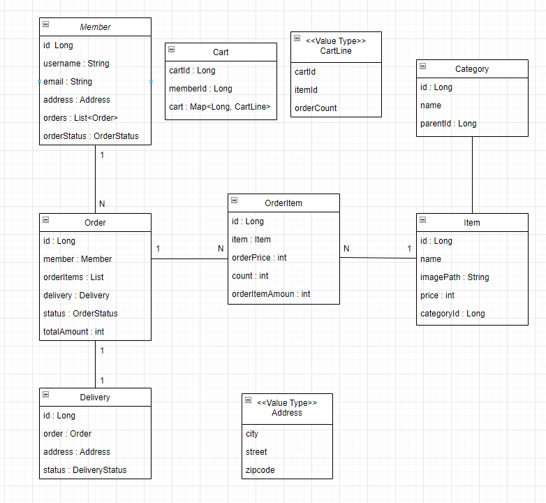

<h1 align="center">JPA 개인 프로젝트</h1>

<p align="center">
  
<p>


## :convenience_store: 프로젝트 소개
```
JPA, querydsl을 활용한쇼핑몰
```


## 📅 개발 기간
```
2023.03.01 ~ 2023.03.14
```

## 🔨 목표

### 목표
1. JPA에 대한 이해와 성능 최적화
2. 유지보수와 새로운 기능 확장을 고려한 설계
3. querydsl 적응
4. entity -> dto 변환 적응

<br><br>

## 🔨 프로젝트 기능
  
티스토리 개인 블로그 - https://philarfun1.tistory.com/
  
1. 도메인 설계 - https://philarfun1.tistory.com/94
1. 로그인 / 회원가입
2. 카테고리 기능 - https://philarfun1.tistory.com/90
3. 장바구니 기능 - https://philarfun1.tistory.com/91
4. 주문 기능 - https://philarfun1.tistory.com/92
5. 주문 내역 조회 기능 - https://philarfun1.tistory.com/93 (N + 1 문제 )
6. 상품 등록 기능
<br><br>


### 1. 도메인
<p align="center">
  
<p>
<br>


<!--Readme 참고 사이트-->
<!--https://github.com/n0hack/readme-template/blob/main/README.md-->
<!--https://github.com/n0hack/readme-template-->
